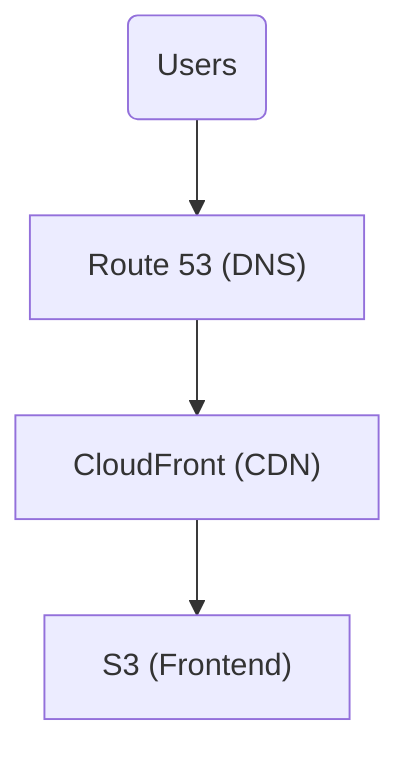

# Back end

## Overview

This repository contains [Terraform](https://developer.hashicorp.com/terraform/intro) code to deploy a static React
frontend to AWS using the following services:

- [Amazon S3](https://docs.aws.amazon.com/s3/): Hosts the frontend assets, as well as the Terraform state
- [Amazon CloudFront](https://docs.aws.amazon.com/cloudfront/): Provides a
  [CDN](https://en.wikipedia.org/wiki/Content_delivery_network) for efficient content delivery
- [AWS Route 53](https://docs.aws.amazon.com/route53/): Manages the domain and its
  [DNS](https://en.wikipedia.org/wiki/Domain_Name_System) records
- [AWS Certificate Manager](https://docs.aws.amazon.com/acm/): Provides an
  [SSL](https://en.wikipedia.org/wiki/Transport_Layer_Security) certificate for secure HTTPS access

## AWS Resources

### S3 (Frontend bucket)

A dedicated S3 bucket is used to store and serve static frontend assets.
Access is restricted via
[CloudFront Origin Access Identity](https://docs.aws.amazon.com/AmazonCloudFront/latest/DeveloperGuide/private-content-restricting-access-to-s3.html),
so that only CloudFront has access.

### CloudFront (CDN)

CloudFront is configured to cache and serve the frontend efficiently.
The certificate is managed by Certificate Manager.

### Route 53 (DNS)

A Route 53 hosted zone is created for the domain, with records pointing to CloudFront.

Note that Terraform does not register the domain; this was done manually in Route 53 because it costs money.

### Certificate Manager (SSL certificate)

A wildcard SSL certificate is created for secure HTTPS access.
It's auto-validated via Route 53 DNS records.

## Deployment

A backend GitHub [workflow](.github/workflows/deploy-infra.yml) deploys the infrastructure via
[Terraform](https://developer.hashicorp.com/terraform/intro).

A frontend GitHub [workflow](https://github.com/DevConnect-Hunter/front-end/blob/main/.github/workflows/deploy-frontend.yml)
builds the React app, uploads it to S3, and invalidates the CloudFront distribution.
